# 3D Slicer Cast Interface Extension

  

---

## Overview

Cast Interface is a 3D Slicer extension focused on desktop integration workflows for healthcare applications.

---

---
## Background

Cast is an offshoot of FHIRcast (<https://fhircast.hl7.org/>). FHIRcast is the standard replacing Epic’s file drop interface for integration with PACS and reporting systems. It provides a secure event messaging infrastructure using a hub with websocket subscriptions.  The following animation shows distribution of a FHIRCast ImagingStudy-open event to all applications over low-latency websocket connections. 
<figure>
  

    
  

</figure>

Cast is focused on desktop integration of all healthcare applications. It is not restricted to a specific data format and does not mandate the development of authorization scoping features.  Cast also has a context sharing strategy and hub architecture that diverges from FHIRcast (see non-conformance statement here).

## Extension Features

The extension features a hub and two cast interfaces:  one for connecting existing extensions like TotalSegmentator to the hub (Resource servers) and another one connect the  slicer viewer (Image Display client)  to the hub.

#### Hub: 
The hub is the server that distributes the messages and handles the data transfer requests over the websocket connection to each client.

#### Resource servers: 
The resource server tab provides a way for other 3D slicer extensions to connect to the hub and provide their resource to the users.  Resource servers subscribe to all user topics for dicom/nifti events and send back results to the user through the hub. Developers can setup a hub in the cloud and connect the extension running on their local machine to the cloud.  The instance in their dev environment is therefore available to their test parters in the cloud without having to deploy their code.

This video shows VolView using the TotalSegmentator extension with the "Resource Server" setup. The video shows the binary transfer through the hub to 3D Slicer, pauses during the segmentation calculation and restarts just before the segmentation is sent to VolView.

#### Image Display Client: 
The image display client provide a PACS client type interface to the 3D slicer viewer. Supported events should be ImagingStudy-open, Imaging-Study-close, dicom-send and request for sceneview.

### Cast Description 

In addition to distributing FHIRcast events, Cast allows the following:

 - Request data from applications such as worklist context, report content, DICOM instance, DICOM metadata, JPEG/PNG screenshots, scene views, etc.

 - Support for binary files transfer; therefore payloads other than FHIR/JSON, such as DICOM, PNG, NIFTi,ect. 

 - Support for resource servers.

 - Group topics for multi-user workflows, such as tumor boards or interventional procedures.

 - Use [IHE actor naming](# "ID — Image Display; EC — Evidence Creator; WORKLIST_CLIENT,ect") for advanced message routing.

 - Support three additional subscription data: 
     - subscriber.product.name, 
     - subscriber.product.version,
     - subscriber.actors
 
 - Support four additional event data: 
     - subscriber.name
     - subscriber.actor
     - target.actor
     - target.product.name

### How does the Cast request work?
There is value to being able to obtain real-time information from other applications in the workfow.  For example, knowing the "sceneview" status of an Image Display application or the current content of the report editor.  This  is different than what a FHIRcast hub would know since it is relies on getting events to maintain it's context which are not generated for each user action. 

The cast request is technically a POST to the hub same as a normal event publish.  The only difference for the client is that the hub does not immediately respond with status code OK but forwards the request through the websocket connections to the relevant subscribers, collates their responses and sends the information back to the client in the POST response.

The following animation shows the added resiliency and data exchange that this feature provides.

*Animation description:  The user is reviewing a report on his tablet and walks over to the workstation to view the images.    The application is launched without context.  The application send a request event to find which study to load from the worklist client and then queries the reporting client to get the measurements in the template.  The measurements are used to populate annotation labeling drop-down in the image display tools.*

  

### How does binary file transfer work?

Cast uses a **notify then download** model: the WebSocket carries JSON and a
`payloadId` per file; file bytes live in the hub’s short-lived HTTP store and 
subscribers call `GET /api/hub/payloads/{payloadId}` to get the files.

All binary uploads use **one STOW batch** per publish — `multipart/related` with
a JSON manifest (`event.context.files[]`) plus one HTTP part per file. That
covers DICOM slices, NIfTI volumes, and other binary-family events. 

Before forwarding the JSON file metadata to the recipients over websocket, the hub adds the short-live payloadId to each file metadata so that they can be downloaded.
For DICOM files, the DICOM metadata of each file is therefore available before the download.  Recipients can select which file they actually need and download those in the order they want.  This provides something similar to DICOM association but at file level and with all info availabl instead of only SOP class UID and transfer syntaxes.  For example, if a complete study is sent to  Total Segmentator, the handler script can choose to only down one series of thin slices; saving time and bandwidth.

The file and DICOM metadata information has to be created by the client publishing the event since the hub does open contaxt data.  

Resource servers (e.g. TotalSegmentator) receive metadata on the socket, then
`fetch_all_payloads` fills `files[].data` before your `onMessage` script runs.

Full description: [docs/binary-file-transfer.md](docs/binary-file-transfer.md).

  

#### Binary transfer filename policy

The hub enforces an **allowlist** on `resource.fileName` and filters out double extensions when it accepts **binary payload bytes**.

##### Default allowed suffixes

Longest match wins (so `study.nii.gz` uses `.nii.gz`, not `.gz`).

| Imaging | Archives / compression |
|---------|-------------------------|
| `.dcm`, `.dicom`, `.dic` | `.zip` |
| `.nii`, `.nii.gz`, `.nrrd` | `.tar`, `.tar.gz`, `.gz` |
| `.png`, `.jpg`, `.jpeg`, `.tif`, `.tiff`, `.bmp` | |

##### Double extensions

After the outer allowlisted suffix is matched, any **earlier** dotted segment
must not be a dangerous type (executables, scripts, installers, etc.).

Examples:

| Filename | Result |
|----------|--------|
| `patient.dcm` | Allowed |
| `volume.nii.gz` | Allowed |
| `bundle.tar.gz` | Allowed |
| `study.dcm.exe` | Rejected (`double_extension`) |
| `malware.exe.dcm` | Rejected |
| `../etc/passwd.dcm` | Rejected (`invalid_file_name`) |

##### Configuration

| Variable | Default | Description |
|----------|---------|-------------|
| `CAST_HUB_FILENAME_POLICY` | on | Set to `off` to disable checks (dev only). |
| `CAST_HUB_ALLOWED_EXTENSIONS` | (see table) | Comma-separated list, e.g. `.dcm,.nii.gz,.zip` |

### Security Benefits for cloud deployment of 3D Slicer extensions 

This architecture protects resource servers by eliminating direct inbound internet exposure entirely.

With resourver servers, developers can connect  the code running on their machine to their cloud hub instance. The instance in their dev environment is therefore available to their test parters in the cloud without having to deploy their code.  

Each resource server establishes only **outbound encrypted connections** to the Cast Hub, which functions exclusively as a  **routing  appliance**. Because no inbound ports need to be opened on hospital or enterprise networks, the resource servers remain protected behind existing firewalls and are never directly reachable from the public internet.

It also simplifies providing resources in-house  since the IT department only needs to add a hostname and rules for the hub.  They do not have to touch their networking every time a new resource server is available for use.  They only have to configure a shared key for it in their auth server.

For the hub, it provides a significantly reduced attack surface and minimizes operational security risk since it maintains no storage or database. 

  

In theory, the hub can be cloud deployed as a serverless application.  In practice, many of those low cost offerings do not support websocket services and a docker based offering is necessary like  Azure WebApps or AWS elastic beanstalk.  

For high availibity deployment a  hot stand-by configuration can be used.  The "reset server" button in the hub admin portal allows testing workflow behavior during failover.

The hub provides a test mock auth endpoint that assigns a user  when none is provided. For public web applications that do not need user authentication but want to use the resource servers, the mock endpoints provide the required functionality.  

The hub also supports a “single-user” mode  for stand-alone applications.

Since the resource servers are not on the internet, you will get shared keys for the auth server. 
 The hub can use domain name certificates.

## Installation

### Install from the 3D Slicer Extension Manager

1. Open **3D Slicer**
2. Open the **Extension Manager**
3. Search for **Cast Interface**
4. Click **Install**
5. Restart 3D Slicer

---

## License

MIT License

---

## Acknowledgements

* 3D Slicer community
* Open-source healthcare ecosystem
* Medical imaging interoperability initiatives
