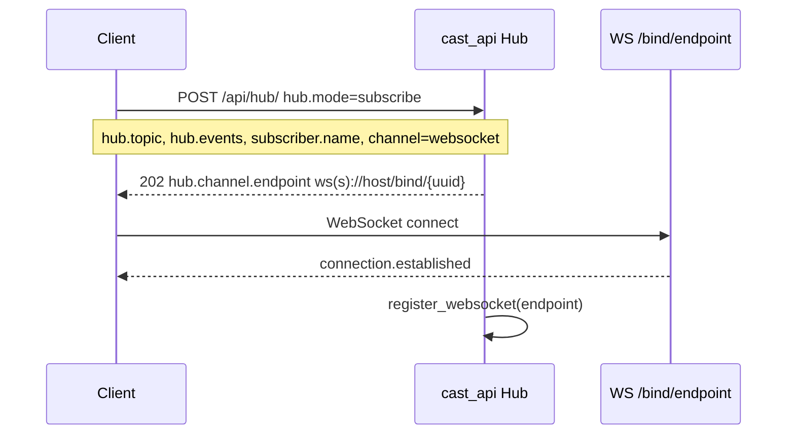
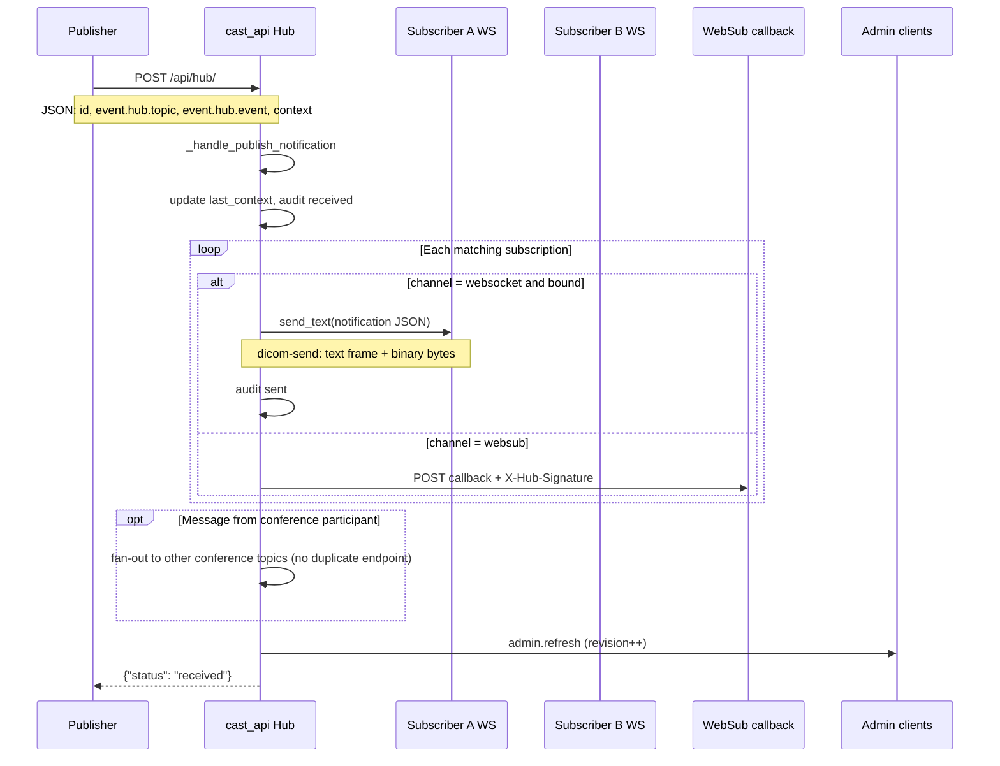
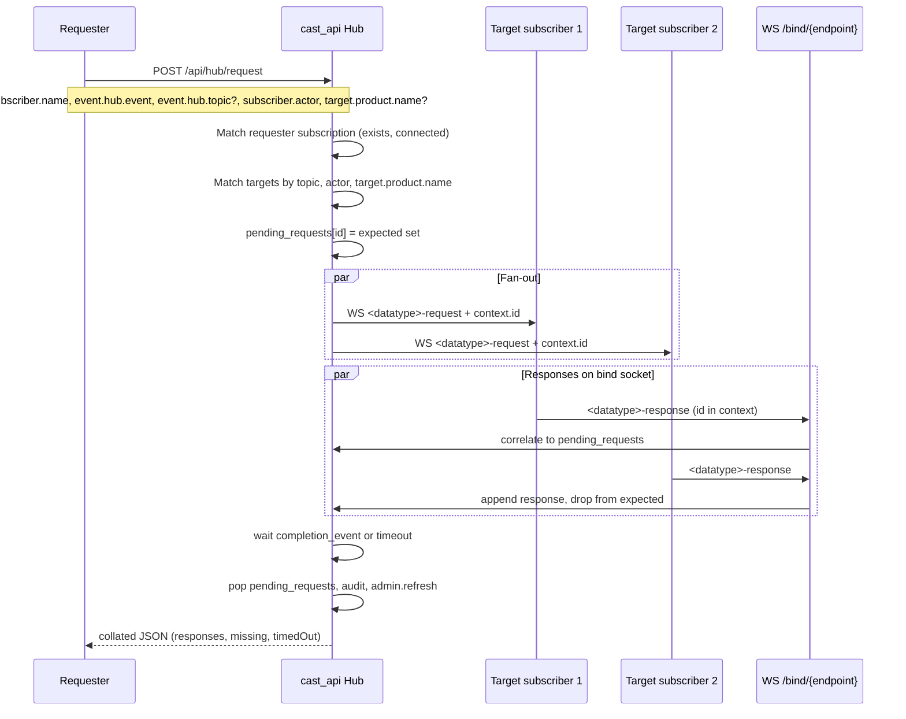

# Cast Hub (`cast_api`)

FastAPI implementation of a [FHIRcast](https://fhircast.org/)-style hub for the ProjectWeek45 stack (VolView, vtk-js CastClient, OHIF cast extension). Subscribers connect over WebSocket (`/bind/{endpoint}`) or WebSub callbacks; the hub fans out events and collates typed request/response traffic.

Run standalone:

```bash
cd VolView/server
python cast_api/cast_api.py --port 2018
```

Or with VolView RPC:

```bash
poetry run python server_with_hub.py --port 4014
```

## Core endpoints

| Method | Path | Purpose |
|--------|------|---------|
| `POST` | `/api/hub/` | Subscribe, unsubscribe, or publish (body with `hub.mode` or `event`) |
| `POST` | `/api/hub/request` | Typed cast request → fan-out → collated HTTP response |
| `WS` | `/bind/{endpoint}` | Receive hub events; send `<datatype>-response` for requests |
| `GET` | `/api/hub/admin` | Admin dashboard HTML |
| `GET` | `/api/hub/admin/snapshot` | JSON dashboard (subscriptions, conferences, audit) |
| `WS` | `/ws/admin` | `admin.refresh` notifications (revision bump) |
| `POST` | `/oauth/authorize`, `/oauth/token` | Dev/mock OAuth for clients |

Conference UI: `/api/hub/conference-client`, APIs under `/api/hub/conference` and `/api/hub/conference-topics`.

Event names (`<datatype>-request` / `<datatype>-response`) are defined in [`cast_client.py`](cast_client.py) (top of file) and mirrored in vtk-js / VolView / OHIF.

---

## Subscribe and bind (prerequisite)

Before publish or request traffic, a client subscribes and opens its bind socket.



---

## Publish flow

A publisher sends a Cast notification to the hub. The hub matches **topic + event type** against each subscription, skips echo to the publisher (`subscriber.name` on the envelope), and delivers to WebSocket or WebSub subscribers. Conference participants may receive an extra copy when the message topic matches an active conference.

**Entry point:** `POST /api/hub/` or `POST /api/hub` (body contains `event` with `event.hub.topic`).



**Matching rules**

- Subscription `topic` must equal `event.hub.topic`, or subscription `topic` may be
  `*` to receive publishes for **any** non-empty `event.hub.topic`.
- Subscription `events` must include the event or `*`.
- Optional publish filters: `target.actor` (role) and `target.product.name` on the notification root
  (matches `client_info.productName` on the subscription).
- Publisher subscriber name is not delivered a copy of its own publish.

### `subscription-removed` (hub lifecycle)

When a subscription is removed (explicit unsubscribe, WebSocket disconnect, or send failure), the hub fans out a **`subscription-removed`** event to other subscribers on the same topic (same matching rules as publish). The removed peer does not receive the notification.

| Field | Description |
| --- | --- |
| `event.hub.event` | `subscription-removed` |
| `event.hub.topic` | Topic of the removed subscription |
| `subscriber.name` | Removed subscriber |
| `subscriber.product.name` | Optional product from subscription `client_info` |
| `event.context.reason` | `unsubscribe`, `websocket-disconnect`, or `send-failure` |
| `event.context.subscriber` | Same as `subscriber.name` |

Subscribe with `subscription-removed` in `hub.events` (or `*`) to receive these notifications.

**Binary file transfer:** STOW batch only — `POST /api/hub/` as `multipart/related` (Cast JSON manifest + one part per `context.files[]` entry). Hub fans out one text WebSocket message with `files[].payloadId`; subscribers download via `GET /api/hub/payloads/{payloadId}` when the app calls `fetch_all_payloads`. Full write-up: Slicer extension `CastInterface/docs/binary-file-transfer.md` (same content as in a pw45 checkout). Legacy `multipart/form-data` returns HTTP 400.

**Filename policy:** When the hub stores binary bytes (HTTP payload store or multipart upload), `resource.fileName` must match an allowlisted suffix and pass a double-extension check. See [filename-policy.md](filename-policy.md). Disable with `CAST_HUB_FILENAME_POLICY=off`.

### DICOM send (`dicom-send`)

VolView publishes study/series/slice data as a single **STOW batch** `dicom-send`: `context.files[]` manifest plus one `application/dicom` part per file (`multipart/related`). Receivers download bytes via `payloadId` when ready. Helpers: VolView `publishDicomSendSeries()` / `publishDicomStowSend()` in [`cast-client.ts`](../../../src/io/cast-client.ts), `buildDicomStowManifest()` in [`build-dicom-stow-manifest.ts`](../../../src/io/cast/build-dicom-stow-manifest.ts).

---

## Cast request flow

A caller uses **HTTP** to ask the hub to dispatch a **typed** request to every matching subscriber. The request body includes top-level `id` and `timestamp` (like publish). Each target receives a WebSocket message with `hub.event = <datatype>-request` and `context.id` set to that correlation id. Targets reply on `/bind/{endpoint}` with `hub.event = <datatype>-response` and the same `context.id`. The hub waits (default 2s, `CAST_REQUEST_TIMEOUT_SECONDS`) and returns one collated JSON body.

**Entry point:** `POST /api/hub/request`



**Target matching**

| Field | Role |
|-------|------|
| `subscriber.name` | Requester identity (must have a subscription; should be WS-connected) |
| `event.hub.event` | Required `*-request` event name (for example `status-request`); hub dispatches this name as-is |
| `event.hub.topic` | Optional; all matches must use this hub topic |
| `event.context.dataType` | Optional handler token (for example `STATUS`, `PNGFULLSIZE`); copied into WS fan-out `context` |
| `subscriber.actor` | Source / requester role (included on forwarded WS events) |
| `target.actor` | Destination filter: subscription `actors` must include this keyword; omitted or `*` = all roles on topic. On POST request body, if `target.actor` is absent, `subscriber.actor` may be used as the filter. WS fan-out uses the same keys. |
| `productName` | Optional filter on `client_info.productName`; `*` means any |

**Event names:** clients send `event.hub.event` as the `*-request` name (build with `request_event_for` from a data-type token). Responses use the matching `*-response` name. Collated HTTP replies still include a top-level `dataType` derived from `event.context.dataType` or the request event name.

**Example request body:**

```json
{
  "subscriber.name": "VolView-ABC123",
  "event": {
    "hub.topic": "my-topic",
    "hub.event": "status-request",
    "context": { "dataType": "STATUS" }
  },
  "subscriber.actor": "WORKLIST_CLIENT",
  "target.actor": "WORKLIST_CLIENT"
}
```

**Collated HTTP response (success shape):**

```json
{
  "ok": true,
  "id": "<uuid>",
  "subscriber.name": "REQUESTER-NAME",
  "dataType": "JPGFULLSIZE",
  "subscriber.actor": "ID",
  "target.actor": "*",
  "responses": [
    {
      "id": "<envelope-id>",
      "subscriber": "VIEWER-ABC",
      "actor": "ID",
      "productName": "OHIF",
      "data": { }
    }
  ],
  "expected": ["VIEWER-ABC"],
  "missing": [],
  "timedOut": false
}
```

Each item in `responses` is one subscriber's `<datatype>-response` payload. The envelope `id` is the message id from the WebSocket event, not a separate `responseId` field.

`SCENEVIEW` uses the same WebSocket fan-out as other data types (`sceneview-request` / `sceneview-response`). Notes for implementing sceneview on the 3D Slicer side are in the CastInterface module's `sceneview-readme.md`.

---

## Admin dashboard

- **HTTP:** `GET /api/hub/admin/snapshot` — full state for the UI.
- **WebSocket:** `WS /ws/admin` — lightweight `admin.refresh` with `revision`; the page reloads snapshot when revision changes.
- **Reset:** `POST /api/admin/reset` — clears subscriptions, audit, conferences, auth codes; optional `single_user_mode`.

---

## Related files

| File | Role |
|------|------|
| [`cast_api.py`](cast_api.py) | Hub app, routes, `CastHub` state |
| [`admin.html`](admin.html) | Admin UI |
| [`cast_client.py`](cast_client.py) | Per-`dataType` event-name helpers; `CastClient` ABC and `SlicerCastClient` |
| [`3dslicer-cast-ai-interface.py`](3dslicer-cast-ai-interface.py) | Standalone Cast subscriber (hub URLs from OHIF `cast.js`) |
| [`CAST-HUB-README.md`](CAST-HUB-README.md) | VolView server run/deploy guide |

For workspace-wide Cast protocol rules (event-name sync across Python/JS/TS, line endings), see [`../../AGENTS.md`](../../AGENTS.md).

---

## Python Cast client

**Library:** [`cast_client.py`](cast_client.py) defines `SlicerCastClient` — OAuth, subscribe, WebSocket bind, publish, and typed `request` / `send_cast_request_response`. It does not embed hub URLs; callers pass `HubConfig` and `SessionConfig`.

**Subscriber identity:** Clients generate `subscriber.name` locally as
`<productName>-<6 random A–Z0-9>` when the session is created (see
`generate_subscriber_name` in Python and `generateSubscriberName` in vtk-js).
Mock OAuth (`/oauth/authorize`, `/oauth/token`) returns tokens and **topic** only;
the hub registers the subscriber name from the subscribe form body.

**Standalone subscriber:** [`3dslicer-cast-ai-interface.py`](3dslicer-cast-ai-interface.py) connects to a remote hub over HTTP/WebSocket. Hub endpoints and OAuth credentials are hardcoded at the top of that file (copied from [`Viewers/platform/app/public/config/cast.js`](../../../Viewers/platform/app/public/config/cast.js) `cast.hubs`). Edit `HUB_NAME` and `TOPIC` before running.

```bash
cd VolView/server
poetry run python cast_api/3dslicer-cast-ai-interface.py
```

| `HUB_NAME` | Hub |
|------------|-----|
| `VOLVIEW-HUB` | `http://localhost:4014/api/hub` (default in interface script) |
| `VOLVIEW-HUB-CLOUD` | VolView Azure |
| `SLICER-HUB-CLOUD` | 3D Slicer Azure |
| `SLICER-HUB` | `http://localhost:2018/api/hub` |

No local hub process is required when using a cloud `HUB_NAME`.
