# Cast description

Cast is focused on desktop integration of all healthcare applications. It is not restricted to a specific data format and does not mandate the development of authorization scoping features

In addition to distributing FHIRcast events, Cast allows the following:

 - Request data from applications such as worklist context, report content, DICOM instance, DICOM metadata, JPEG/PNG screenshots, scene views, etc.

 - Support for binary files transfer; therefore payloads other than FHIR/JSON, such as DICOM, PNG, NIFTi,ect. 

 - Support for resource servers.

 - Group topics for multi-user workflows, such as tumor boards or interventional procedures.

 - Use IHE actor naming (ID — Image Display; EC — Evidence Creator; WORKLIST_CLIENT, etc.) for advanced message routing.

 - Support three additional subscription data: 
     - subscriber.product.name, 
     - subscriber.product.version,
     - subscriber.actors
 
 - Support four additional event data: 
     - subscriber.name
     - subscriber.actor
     - target.actor
     - target.product.name

 - Support for an hub-generated `subscription-removed` event when an application disconnects from the websocket.     

## How does the Cast request work?

There is value to being able to obtain real-time information from other applications in the workfow.  For example, knowing the "sceneview" status of an Image Display application or the current content of the report editor.  This  is different than what a FHIRcast hub would know since it is relies on getting events to maintain it's context which are not generated for each user action. 

The cast request is technically a POST to the hub same as a normal event publish.  The only difference for the client is that the hub does not immediately respond with status code OK but forwards the request through the websocket connections to the relevant subscribers, collates their responses and sends the information back to the client in the POST response.

In practice, each application supports responding to a status-request event.  On start-up the application publishes a status-request that is forwarded  all applications in the user workflow. The hub collates the responses and then the app makes the best use of that information to  display relevenant information at launch.

The following animation shows the added resiliency and data exchange that this feature provides.

*Animation description:  The user is reviewing a report on his tablet and walks over to the workstation to view the images.    The application is launched without context.  The application send a request event to find which study to load from the worklist client and then queries the reporting client to get the measurements in the template.  The measurements are used to populate annotation labeling drop-down in the image display tools.*

  

## How does binary file transfer work?

Cast uses a **notify then download** model: the WebSocket carries JSON and a
`payloadId` per file; file bytes live in the hub’s short-lived HTTP store and 
subscribers call `GET /api/hub/payloads/{payloadId}` to get the files.

All binary uploads use **one STOW batch** per publish — `multipart/related` with
a JSON manifest (`event.context.files[]`) plus one HTTP part per file. That
covers DICOM slices, NIfTI volumes, and other binary-family events. 

Before forwarding the JSON file metadata to the recipients over websocket, the hub adds the short-live payloadId to each file metadata so that they can be downloaded.
For DICOM files, the DICOM metadata of each file is therefore available before the download.  Recipients can select which file they actually need and download those in the order they want.  This provides something similar to DICOM association but at file level and with all info availabl instead of only SOP class UID and transfer syntaxes.  For example, if a complete study is sent to  Total Segmentator, the handler script can choose to only down one series of thin slices; saving time and bandwidth.

The file and DICOM metadata information has to be created by the client publishing the event since the hub does open contaxt data.  

When the resource server has the same data access as the image display, like the in vtk-js worklist example where all data is online, the image display does not have to send the binary files.  Oly the json message is sent and the resource server downloads the input data itself and sends the result binaries back to the image display as shown below.

Resource servers (e.g. TotalSegmentator) receive metadata on the socket, then
`fetch_all_payloads` fills `files[].data` before your `onMessage` script runs.

Full description: [binary-file-transfer.md](binary-file-transfer.md).

  

The hub filename policy is the [following](filename-policy.md).
