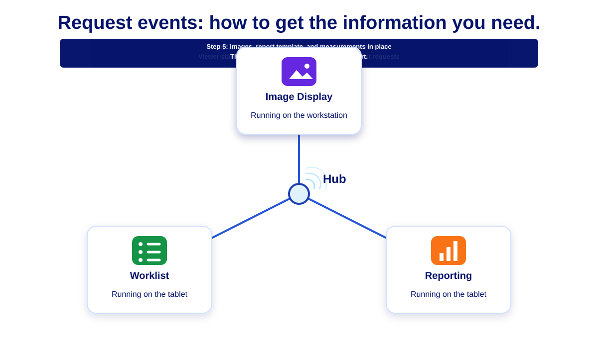
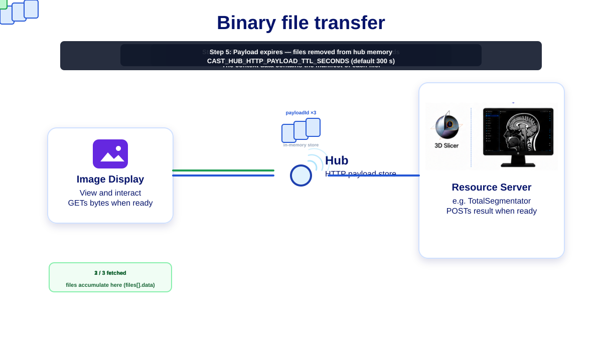
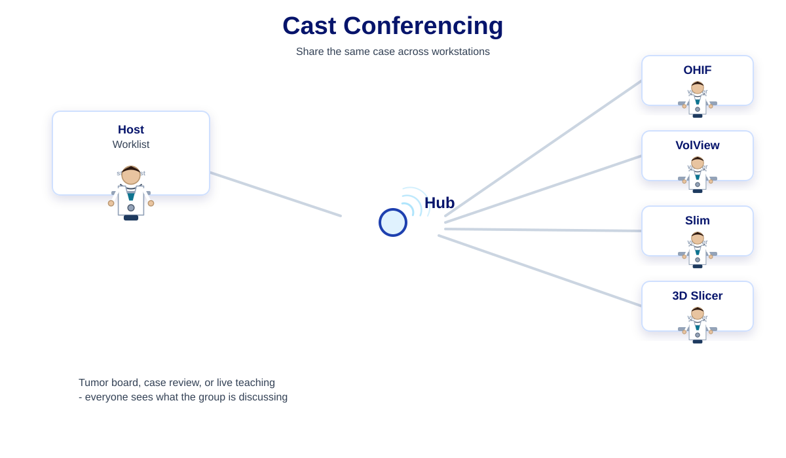
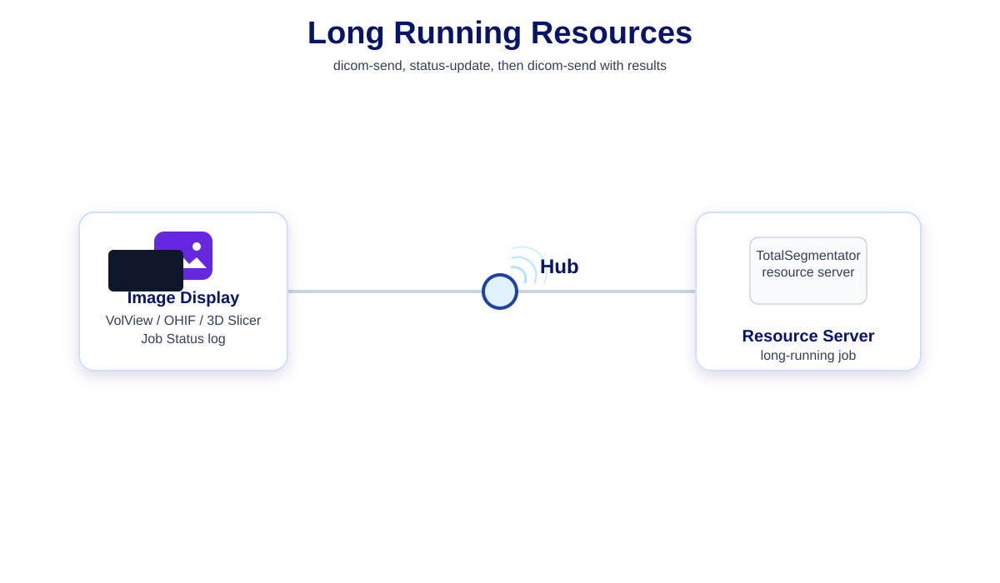

# Cast description

Cast is focused on desktop integration of all healthcare applications. It is not restricted to a specific data format and does not mandate the development of authorization scoping features.

In addition to distributing FHIRcast events, cast allows the following:

 - Request data from applications.
 - File transfer.
 - Resource servers with long running jobs.
 - Conferencing.
 - IHE actor naming for advanced message routing.
 - Three additional subscription fields:
     - subscriber.product.name,
     - subscriber.product.version,
     - subscriber.actors
 - Four additional event fields:
     - subscriber.name
     - subscriber.actor
     - target.actor
     - target.product.name

 - Additional hub-generated `subscription-removed` event when an application disconnects  from the WebSocket.

## How does the request work?

There is value to being able to obtain real-time information from other applications in the workflow. For example, knowing the "sceneview" status of an Image Display application or the current content of the report editor. This is different than what a FHIRcast hub would know since it relies on getting events to maintain its context which are not generated for each user action.

The cast request is technically a POST to the hub, same as a normal event publish. The only difference for the client is that the hub does not immediately respond with status code OK but forwards the request through the WebSocket connections to the relevant subscribers, collates their responses and sends the information back to the client in the POST response.

In practice, each application supports responding to a status-request event in less than 2 seconds. On start-up the application publishes a status-request that is forwarded to all applications in the user workflow. The hub collates the responses and then the application makes the best use of that information to display relevant information at launch.

The following animation shows the added resilience and data exchange that this feature provides.

*Animation description: The user is reviewing a report on his tablet and walks over to the workstation to view the images. The application is launched without context. The application sends a request event to find which study to load from the worklist client and then queries the reporting client to get the measurements in the template. The measurements are used to populate annotation labeling drop-down in the image display tools.*

**[Interactive step-by-step version (GitHub Pages)](https://mbellehumeur.github.io/SlicerCastInterface/images/request-event-flow-interactive.svg)** — click to play each step.

  

## How does file transfer work?

Cast uses a **notify then download** model: the WebSocket carries JSON and a
`payloadId` per file; file bytes live in the hub’s short-lived HTTP store and
subscribers call `GET /api/hub/payloads/{payloadId}` to get the files.

All binary uploads use **one binary batch** per publish — `multipart/related` with
a JSON manifest (`event.context.files[]`) plus one HTTP part per file. That
covers DICOM slices, NIfTI volumes, and other binary-family events.

Before forwarding the JSON file metadata to the recipients over WebSocket, the hub adds the short-lived payloadId to each file metadata so that they can be downloaded.
For DICOM files, the DICOM metadata of each file is therefore available before the download. Recipients can select which file they actually need and download those in the order they want. This provides something similar to DICOM association but at file level and with all info available instead of only SOP class UID and transfer syntaxes. For example, if a complete study is sent to TotalSegmentator, the handler script can choose to only download one series of thin slices; saving time and bandwidth.

The file and DICOM metadata information has to be created by the client publishing the event since the hub does not parse context data.

When the resource server has the same data access as the image display, like in the vtk-js worklist example where all data is online, the image display does not have to send the binary files. Only the JSON message is sent and the resource server downloads the input data itself and sends the result binaries back to the image display as shown below.

Resource servers (e.g. TotalSegmentator) receive metadata on the socket, then
`fetch_all_payloads` fills `files[].data` before your `onMessage` script runs.

Full description: [binary-file-transfer.md](binary-file-transfer.md).
**[Interactive step-by-step diagram (GitHub Pages)](https://mbellehumeur.github.io/SlicerCastInterface/binary-file-transfer.html)**

  

The hub filename policy is [documented here](filename-policy.md).

## How does conferencing work?

Normally each clinician’s viewer stays on its own session. Conferencing lets a
**host** start a shared meeting — from the worklist, OHIF, VolView, Slim, or
3D Slicer — and invite colleagues who are already connected to the hub. For the
duration of the meeting, when anyone in the group opens a study, changes slices,
or shares annotations, the others see the same updates in real time.

Typical uses include tumor boards, case discussions, ultrasound review with a
remote physician, and teaching sessions where the group should follow one
presenter without logging into the same account.

The following animation shows the idea at a glance. For setup, APIs, and UI
details, see [conference-readme.md](conference-readme.md).

*Animation description: The host starts a conference from the worklist and invites
colleagues on OHIF, VolView, Slim, and 3D Slicer. The hub links their sessions.
When the host opens a study, the same case appears on every participant’s screen
and stays in sync as the group works together.*

**[Interactive step-by-step version (GitHub Pages)](https://mbellehumeur.github.io/SlicerCastInterface/images/conference-animated-interactive.svg)** — click to play each step.

  

## How do long running resources integrate?

Resource servers such as TotalSegmentator connect to the hub like any other cast
client, but their work takes seconds or minutes instead of a single instant
response. The viewer sends the input study with **dicom-send** (binary batch
upload through the hub). While the server runs, it publishes **status-update**
lines to the viewer’s job log so the user sees progress. When the job finishes,
the server sends the result segmentation with another **dicom-send** and the
viewer loads the overlay.

The following animation shows that three-step pattern. For job-status event
details see [status-readme.md](status-readme.md); for file transfer mechanics
see [binary-file-transfer.md](binary-file-transfer.md).

*Animation description: VolView sends a study to TotalSegmentator with
dicom-send. The resource server runs segmentation and publishes several
status-update messages. It then returns the SEG result with a second
dicom-send, which the image display loads.*

  

