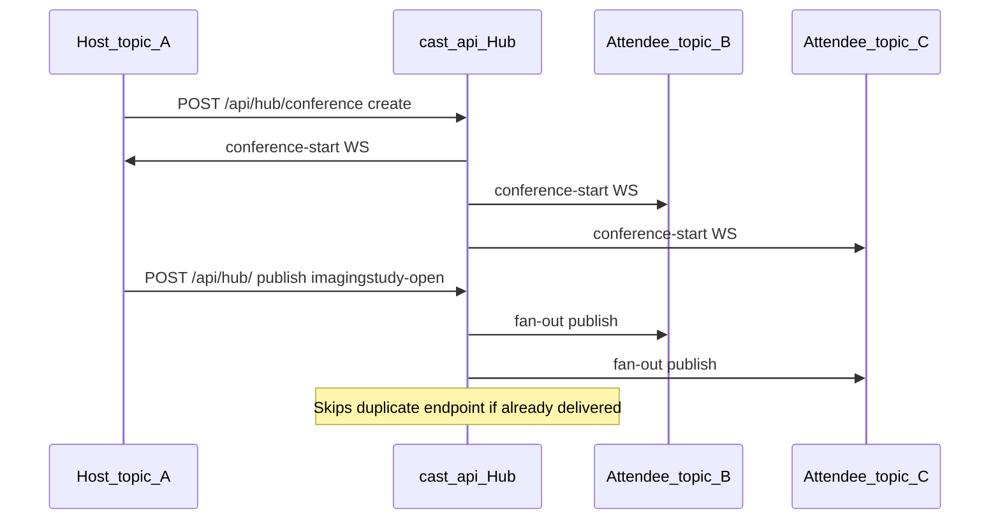

# Conferencing

Cast’s default routing is **topic-scoped**: a publish on `hub.topic = USER-A` only
reaches subscribers bound to `USER-A`. Conferencing adds a **hub-managed session**
that groups multiple topics so that when **any participant** publishes, **all other
participants** also receive the event (cross-topic fan-out), without merging everyone
onto one OAuth topic.

This complements per-user OAuth topics — each participant keeps their own topic and
subscriber identity. The hub bridges traffic between topics for the duration of an
active conference.

Authoritative hub code: `CastInterface/cast_api/cast_api.py`. Conference UI:
`CastInterface/cast_api/Resources/conference-client.html`.

---

## Use cases

| Workflow | What conferencing enables |
|----------|---------------------------|
| Tumor board | Multiple clinicians on separate topics see the same study-open, DICOM, or annotation events |
| US annotations | Sonographer and reviewing physician share annotation and image traffic across topics |
| Case discussion | Attendees follow the host’s navigation without sharing one login topic |
| Pedicle screw planning | Interventional team members receive the same slice and measurement events |

Without conferencing, each user’s events stay on their own topic. Conferencing is the
hub’s way to implement the “group topics” capability described in
[cast-description.md](cast-description.md).

---

## Conference record

The hub stores conferences in memory on `CastHub.conferences`. Each record has this
shape:

```json
{
  "hostTopic": "USER-A",
  "title": "Tumor Board",
  "topics": ["USER-B", "USER-C"]
}
```

| Field | Meaning |
|-------|---------|
| `hostTopic` | Host **hub topic** used for fan-out matching and conference teardown |
| `title` | Human-readable session name (preset or custom) |
| `topics` | Attendee **hub topics** — values from active WebSocket subscriptions |

Legacy records may still use `user` instead of `hostTopic`; the hub and clients accept
both via `hostTopic || user`.

Fan-out keys off `event.hub.topic` on each publish, not `subscriber.name`. Attendee
topics come from `GET /api/hub/conference-topics`, which lists distinct subscription
topics (excluding `*`).

---

## HTTP APIs

| Method | Path | Purpose |
|--------|------|---------|
| `GET` | `/api/hub/conference-client` | Conference UI (`?theme=3dslicer` or `?theme=volview`) |
| `GET` | `/api/hub/conference-topics` | Topics for the attendee picker |
| `GET` | `/api/hub/conference` | List active conferences |
| `POST` | `/api/hub/conference` | Create a conference |
| `DELETE` | `/api/hub/conference` | End conference (host) or leave as attendee |

### Create conference

`POST /api/hub/conference`:

```json
{
  "hostTopic": "USER-A",
  "title": "Tumor Board",
  "topics": ["USER-B", "USER-C"]
}
```

`hostTopic` is required (legacy `user` is accepted). `title` is required. Attendee
topics are deduplicated; the host topic is never stored in `topics[]`.

Response: `{"status": "created", "conference": { ... }}`.

On success the hub appends the record, sends `conference-start` to all participant
WebSockets, and bumps the admin dashboard revision.

### End or leave conference

`DELETE /api/hub/conference` with `hostTopic` (legacy `user` accepted):

**Host ends the session** — omit `leaveTopic`:

```json
{
  "hostTopic": "USER-A"
}
```

Removes the conference, sends `conference-end` with `reason: "host-ended"` to every
participant topic, and returns `{"removed": 1, "updated": 0}`.

**Attendee leaves** — include `leaveTopic`:

```json
{
  "hostTopic": "USER-A",
  "leaveTopic": "USER-B"
}
```

Removes only that topic from `topics[]`, sends `conference-end` with
`reason: "attendee-left"` and `leaveTopic` to the leaving subscriber, and returns
`{"removed": 0, "updated": 1}`. Other participants stay in the conference until the
host ends it or they leave.

### Conference UI

**Primary:** VolView, OHIF, and the vtk-js CastClient example open an in-app
**Conferencing** dialog from the Cast header menu (or the test bench **Conference**
button in the vtk-js example).

**Fallback:** `GET /api/hub/conference-client` serves a standalone HTML page for hub
testing, Slicer-only workflows, and clients that have not yet integrated a native
panel (e.g. the vtk-js CastClient example still opens the hub popup).

Popup URL (fallback):

```
/api/hub/conference-client?subscriberName=VolView-ABC123&topic=USER-A&theme=volview&mode=dark
```

`topic` is required for create — the UI posts that value as `hostTopic`. VolView and
OHIF use native dialogs (automatic app theme). The hub HTML page accepts `theme` and
`mode` query parameters.

Helpers: `resolveCastConferenceClientUrl()` in VolView `src/io/cast/hub-links.ts` and
the OHIF cast extension `cast-hub-links.ts` (popup fallback only).

---

## User workflow

1. Each participant authenticates and subscribes on their own hub topic (normal Cast
   connect flow).
2. The host opens **Conferencing** from the Cast header menu (VolView, OHIF, or the
   vtk-js CastClient example).
3. The conference client shows the host’s subscriber name and topic in the context bar.
4. The host selects a title (preset or custom) and checks attendee topics from the
   active-subscription list.
5. **Create conference** posts to the hub.
6. All participants receive `conference-start` on their bind WebSocket.
7. Subsequent publishes from any participant are delivered to every other participant
   (see fan-out below).
8. The host ends the session with **End conference**; attendees use **Leave conference**.
   Hub admin reset also clears all sessions.

Preset titles in the UI: Test conference, US annotations, Tumor Board, Case
discussion, Pedicle screw, or a custom title.

---

## `conference-start` event

When a conference is created, the hub sends this Cast notification to each participant
WebSocket:

```json
{
  "timestamp": "2026-06-13T12:00:00",
  "id": "<uuid>",
  "event": {
    "hub.topic": "USER-A",
    "hub.event": "conference-start",
    "context": {
      "title": "Tumor Board",
      "hostTopic": "USER-A",
      "participants": ["VolView-ABC123", "OHIF-XYZ789"]
    }
  }
}
```

| Field | Description |
|-------|-------------|
| `context.title` | Conference title from the create request |
| `context.hostTopic` | Host hub topic |
| `context.participants` | Subscriber names (`subscriber` on each matched subscription) |

## `conference-end` event

When a conference ends or an attendee leaves, the hub sends:

```json
{
  "timestamp": "2026-06-13T12:30:00",
  "id": "<uuid>",
  "event": {
    "hub.topic": "USER-A",
    "hub.event": "conference-end",
    "context": {
      "title": "Tumor Board",
      "hostTopic": "USER-A",
      "reason": "host-ended"
    }
  }
}
```

For attendee leave, `reason` is `"attendee-left"` and `leaveTopic` names the topic
that left. The event is delivered only to the leaving subscriber in that case; on
host end it goes to all participant topics.

**Client indicator:** VolView, OHIF, and the vtk-js CastClient example handle
`conference-start` and `conference-end`. When connected and the session topic matches
an active conference, the Cast header icon **blinks** (1.2 s cycle). State turns on
immediately on `conference-start`, turns off on `conference-end` (or when the 30 s poll
no longer lists the session), and is refreshed via `GET /api/hub/conference`.
Shared helpers: `conference-status.ts` in VolView and the OHIF cast extension.

---

## Cross-topic publish fan-out

After normal subscription matching on `POST /api/hub/`, the hub loops active
conferences. If the publish topic matches the conference host identifier or any
attendee topic, the hub delivers the same notification to **all other** participant
topics.



**Matching rule:** `event.hub.topic` equals the conference `hostTopic` (or legacy
`user`) or appears in `topics[]`.

**Delivery rules:**

- Fan-out runs after the standard topic + event subscription match.
- Endpoints that already received the message in the normal pass are skipped (no
  duplicate WebSocket frame).
- Publisher echo suppression still applies: the publishing `subscriber.name` does not
  receive a second copy from the conference pass.
- Conference deliveries are audit-logged like normal fan-out (`direction: sent`).

Cast requests (`POST /api/hub/request`) are not conference-bridged — only publish
notifications use cross-topic fan-out.

---

## Admin and lifecycle

- **Admin dashboard:** `GET /api/hub/admin` lists active conferences (title, host,
  attendee topics). Data comes from `GET /api/hub/admin/snapshot`.
- **Reset:** `POST /api/admin/reset` clears all conferences along with subscriptions
  and the audit log.
- **Persistence:** Conference state is in-memory only. Restarting the hub drops all
  active sessions.


