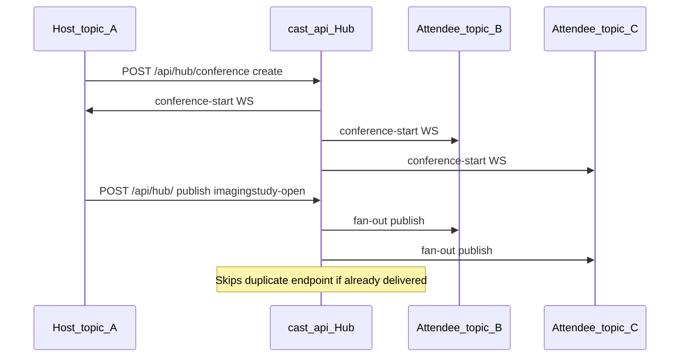

# Conferencing

Cast’s default routing is **topic-scoped**: a publish on `hub.topic = USER-A` only
reaches subscribers bound to `USER-A`. Conferencing adds a **hub-managed session**
that groups multiple topics so that when **any participant** publishes, **all other
participants** also receive the event (cross-topic fan-out), without merging everyone
onto one OAuth topic.

This complements per-user OAuth topics — each participant keeps their own topic and
subscriber identity. The hub bridges traffic between topics for the duration of an
active conference.

Authoritative hub code: `CastInterface/cast_api/cast_api.py`. Conference UI:
`CastInterface/cast_api/Resources/conference-client.html`.

---

## Use cases

| Workflow | What conferencing enables |
|----------|---------------------------|
| Tumor board | Multiple clinicians on separate topics see the same study-open, DICOM, or annotation events |
| US annotations | Sonographer and reviewing physician share annotation and image traffic across topics |
| Case discussion | Attendees follow the host’s navigation without sharing one login topic |
| Pedicle screw planning | Interventional team members receive the same slice and measurement events |

Without conferencing, each user’s events stay on their own topic. Conferencing is the
hub’s way to implement the “group topics” capability described in
[cast-description.md](cast-description.md).

---

## Conference record

The hub stores conferences in memory on `CastHub.conferences`. Each record has this
shape:

```json
{
  "user": "<host identifier>",
  "title": "Tumor Board",
  "topics": ["USER-B", "USER-C"]
}
```

| Field | Meaning |
|-------|---------|
| `user` | Host identifier used for fan-out matching and conference teardown |
| `title` | Human-readable session name (preset or custom) |
| `topics` | Attendee **hub topics** — values from active WebSocket subscriptions |

Fan-out keys off `event.hub.topic` on each publish, not `subscriber.name`. Attendee
topics come from `GET /api/hub/conference-topics`, which lists distinct subscription
topics (excluding `*`).

---

## HTTP APIs

| Method | Path | Purpose |
|--------|------|---------|
| `GET` | `/api/hub/conference-client` | Conference UI (`?theme=3dslicer` or `?theme=volview`) |
| `GET` | `/api/hub/conference-topics` | Topics for the attendee picker |
| `GET` | `/api/hub/conference` | List active conferences |
| `POST` | `/api/hub/conference` | Create a conference |
| `DELETE` | `/api/hub/conference` | End a conference (host) |

### Create conference

`POST /api/hub/conference`:

```json
{
  "user": "USER-A",
  "title": "Tumor Board",
  "topics": ["USER-B", "USER-C"]
}
```

Response: `{"status": "created"}`.

On success the hub appends the record, sends `conference-start` to all participant
WebSockets, and bumps the admin dashboard revision.

### End conference

`DELETE /api/hub/conference`:

```json
{
  "user": "USER-A"
}
```

Removes every conference whose `user` field matches. Returns the removed records.

### Conference client URL

Image Display clients open the UI from the Cast header **Conferencing** menu. The
popup URL is built with the hub origin plus query parameters:

```
/api/hub/conference-client?subscriberName=VolView-ABC123&topic=USER-A
```

Helpers: `resolveCastConferenceClientUrl()` in VolView `src/io/cast/hub-links.ts` and
the OHIF cast extension `cast-hub-links.ts`. Popup size defaults to 380×288 (set by the opener).

---

## User workflow

1. Each participant authenticates and subscribes on their own hub topic (normal Cast
   connect flow).
2. The host opens **Conferencing** from the Cast header menu (VolView, OHIF, or the
   vtk-js CastClient example).
3. The conference client shows the host’s subscriber name and topic in the context bar.
4. The host selects a title (preset or custom) and checks attendee topics from the
   active-subscription list.
5. **Create conference** posts to the hub.
6. All participants receive `conference-start` on their bind WebSocket.
7. Subsequent publishes from any participant are delivered to every other participant
   (see fan-out below).
8. The host ends the session with **Exit conference** or via hub admin reset.

Preset titles in the UI: Test conference, US annotations, Tumor Board, Case
discussion, Pedicle screw, or a custom title.

---

## `conference-start` event

When a conference is created, the hub sends this Cast notification to each participant
WebSocket:

```json
{
  "timestamp": "2026-06-13T12:00:00",
  "id": "<uuid>",
  "event": {
    "hub.topic": "USER-A",
    "hub.event": "conference-start",
    "context": {
      "title": "Tumor Board",
      "participants": ["VolView-ABC123", "OHIF-XYZ789"]
    }
  }
}
```

| Field | Description |
|-------|-------------|
| `context.title` | Conference title from the create request |
| `context.participants` | Subscriber names (`subscriber` on each matched subscription) |

VolView, OHIF, and vtk-js do not ship a dedicated `conference-start` handler today.
Apps that want UI feedback (banner, session indicator) should include `conference-start`
in `hub.events` or subscribe with `*`.

**Client indicator:** When connected and the session topic (or subscriber name for hosts)
matches an active conference, the Cast header icon **blinks** (1.2 s cycle).
State is set immediately on `conference-start` and refreshed every 30 s via
`GET /api/hub/conference`.

---

## Cross-topic publish fan-out

After normal subscription matching on `POST /api/hub/`, the hub loops active
conferences. If the publish topic matches the conference host identifier or any
attendee topic, the hub delivers the same notification to **all other** participant
topics.



**Matching rule:** `event.hub.topic` equals the conference `user` field or appears in
`topics[]`.

**Delivery rules:**

- Fan-out runs after the standard topic + event subscription match.
- Endpoints that already received the message in the normal pass are skipped (no
  duplicate WebSocket frame).
- Publisher echo suppression still applies: the publishing `subscriber.name` does not
  receive a second copy from the conference pass.
- Conference deliveries are audit-logged like normal fan-out (`direction: sent`).

Cast requests (`POST /api/hub/request`) are not conference-bridged — only publish
notifications use cross-topic fan-out.

---

## Admin and lifecycle

- **Admin dashboard:** `GET /api/hub/admin` lists active conferences (title, host,
  attendee topics). Data comes from `GET /api/hub/admin/snapshot`.
- **Reset:** `POST /api/admin/reset` clears all conferences along with subscriptions
  and the audit log.
- **Persistence:** Conference state is in-memory only. Restarting the hub drops all
  active sessions.

---

## Limitations and current behavior

Integrators should be aware of the following when using or extending conferencing:

1. **Host identifier vs topic.** The conference-client UI currently POSTs
   `user: subscriberName` (for example `VolView-ABC123`), while fan-out compares
   `event.hub.topic` (for example `USER-A`). Attendee topics work as designed.
   Host bridging only works when the `user` field aligns with the host’s publish topic.
   API callers should pass the host **hub topic** as `user` if they need reliable
   host-side cross-topic delivery.

2. **Attendee exit.** The manage UI shows **Exit conference** for attendees whose
   topic is in `topics[]`, but `DELETE` removes the whole conference by matching the
   host `user` field. Removing a single attendee from `topics[]` is not implemented.

3. **No request bridging.** Typed cast requests stay topic-scoped; only publish
   notifications participate in conference fan-out.

4. **Ephemeral state.** Conferences are not stored to disk or a database.

---

## Related files

| File | Role |
|------|------|
| `CastInterface/cast_api/cast_api.py` | Conference APIs, `conference-start`, publish fan-out |
| `CastInterface/cast_api/Resources/conference-client.html` | Create / manage / list UI |
| `CastInterface/cast_api/Resources/admin.html` | Admin conferences table |
| `VolView/src/io/cast/hub-links.ts` | `resolveCastConferenceClientUrl`, popup helper |
| `Viewers/extensions/cast/src/cast/cast-hub-links.ts` | OHIF copy of hub link helpers |
| `VolView/src/components/CastHeaderStatus.vue` | Conferencing menu entry |
| `Viewers/extensions/cast/src/components/CastHeaderStatus.tsx` | OHIF Conferencing menu entry |
| `vtk-js/Sources/IO/Core/CastClient/example/index.js` | CastClient Conferencing button |

Hub endpoint summary: `CastInterface/cast_api/docs/README.md` (publish flow diagram
includes the conference fan-out branch).
