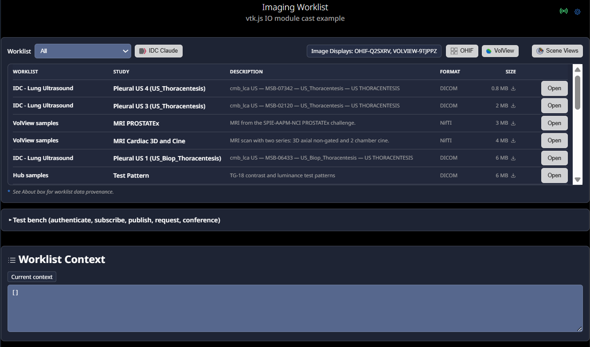
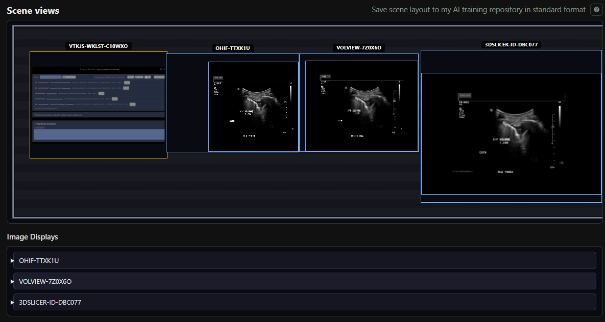
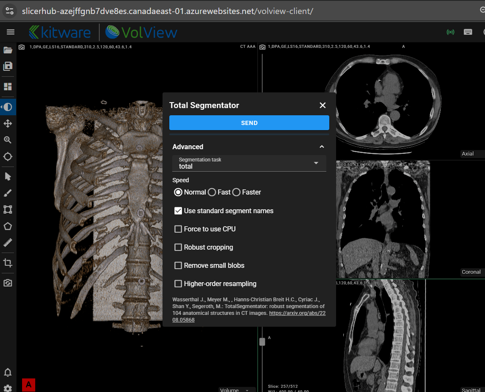
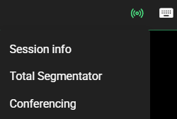
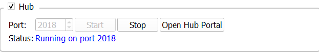
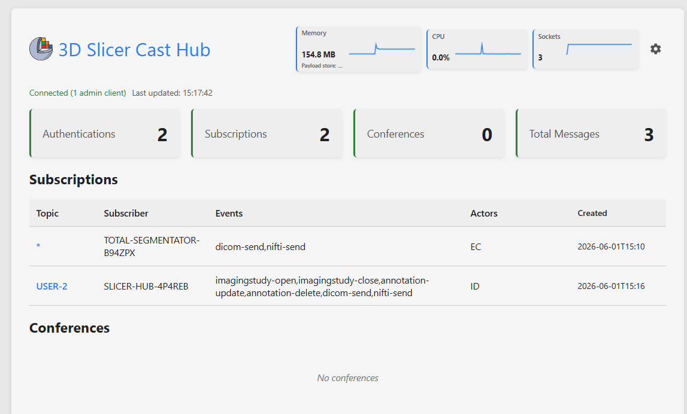
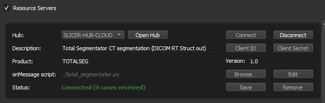
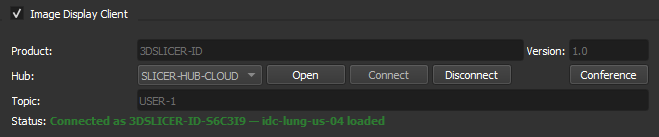
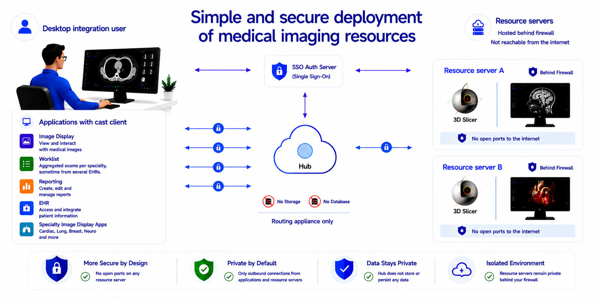

# 3D Slicer Cast Interface Extension

  

---

## Overview

Cast Interface is a 3D Slicer extension focused on desktop integration workflows for healthcare providers and researchers.

## Background

Cast is an offshoot of FHIRcast (<https://fhircast.hl7.org/>). FHIRcast is the standard replacing Epic’s file drop interface for integration with PACS and reporting systems. It provides a secure event messaging infrastructure using a hub with websocket subscriptions. The following animation shows distribution of a FHIRCast ImagingStudy-open event to all applications over low-latency websocket connections.
<figure>
  

    
  

</figure>

You can test websocket subscription integration with the vtk-js IO module cast interface example. Open several viewer instances, open a study in the worklist and use the "Open scene views" button to view cross-product multi-host display layouts:
[Open worklist demo](https://slicerhub-azejffgnb7dve8es.canadaeast-01.azurewebsites.net/worklist-client/examples/CastClient/index.html)

The worklist example demonstrates:

- **IDC MCP server** — Build a personal IDC study worklist from natural-language queries.
- **OHIF** — Open OHIF viewer instances that stay in sync with the worklist.
- **VolView** — Open VolView instances that stay in sync with the worklist.
- **Slim** — Open Slim instances that stay in sync with the worklist.
- **Scene views** — Show each connected image display’s layout (including 3D slicer on same or remote hosts): 

- **Total Segmentator** — From OHIF or VolView, send an MR or CT study to TotalSegmentator and receive segmentation results (SEG or RTSTRUCT). Total segmentator is connected to the hub as a resource server. 

- **Conferencing** — From worklist, Slim, OHIF, VolView or 3D Slicer use the radio icon to start a conference: 

Cast has a context/content sharing strategy and hub architecture that differs somewhat from FHIRcast, see description [here](CastInterface/docs/cast-description.md).

## Extension Features

The extension features a hub and two cast interfaces: one for connecting backend agents like Total Segmentator (Resource servers) and another one to connect the Slicer viewer (Image Display client) to the hub.

#### Hub:
The hub is the routing appliance that distributes the messages and handles the data transfer requests over the websocket to each client.  It allows clients to connect to each other through a single connection instead of developing mutiple interfaces.

It can be used without the slicer extension by running the "cast_api.py" script. 

#### Resource servers:

Resource servers are agents that provide backend services to desktop integration. This allows users to, for example, view AI results without having to send them to the archive first.

The resource server tab provides a visual description of how processing resources can be connected to the hub and made available to cast workflows.

Resource servers subscribe to all user topics for status-request and dicom/nifti events.
In the example, Total Segmentator sends binary results back to the user through the hub.

Since these resources do not log in as a user, they need a *resource server entry* in the customer's authorization server. This provides a client id and client secret. For the cast extension hub, they must be configured in the environment variables of the hub for the resource to connect successfully.

#### Image Display Client:
The image display client provides a PACS client type interface to the 3D Slicer viewer. Supported events include ImagingStudy-open, ImagingStudy-close, dicom-send, and status-request (embedded sceneview).

### Simplified, secure deployment of medical imaging services

This architecture protects resource servers by eliminating direct inbound internet exposure entirely. No hostname is required and no changes to the networking environment are needed. No VPN or proxy to configure.

Each resource server establishes only outbound encrypted connections to the hub, which functions exclusively as a routing appliance. Because no inbound ports need to be opened on hospital or enterprise networks, the resource servers remain protected behind existing firewalls and are never directly reachable from the public internet.

It also simplifies providing resources in-house since the IT department only needs to add a hostname and rules for the hub. They do not have to touch their networking every time a new resource server is available for use. They only have to configure a shared resource server key for it in their authorization server.

For the hub, the architecture provides a significantly reduced attack surface and minimizes operational security risk since it maintains no storage or database.

  

After installation, the resource servers outbound ports can also be locked down, allowing access to the hub and sites needed by the resource only.

In theory, the hub can be cloud deployed as a serverless application. In practice, many of those low-cost offerings do not support websocket services and a docker based offering is necessary like Azure WebApps or AWS Elastic Beanstalk.

- **Cast hub on Azure App Service:** [azure-webapp.md](CastInterface/cast_api/azure-webapp.md)
- **3D Slicer on Azure (Windows GPU VM + RDP):** [azure-slicer-gpu-readme.md](CastInterface/docs/azure-slicer-gpu-readme.md)

For high availability deployment a hot standby configuration can be used. The "reset server" button in the hub admin portal allows testing workflow behavior during failover.

The hub provides a test mock auth endpoint that assigns a user when none is provided. For public web applications that do not need user authentication but want to use the resource servers, the mock endpoints provide the required functionality.

Since the resource servers are not on the internet, you will get shared keys for the auth server. The hub can use domain name certificates.

## Installation

### Install from the 3D Slicer Extension Manager

1. Open **3D Slicer**
2. Open the **Extension Manager**
3. Search for **Cast Interface**
4. Click **Install**
5. Restart 3D Slicer

---

## License

Cast Interface is distributed under the [MIT License](LICENSE).

## Acknowledgements

**3D Slicer** — open-source platform for medical image computing from the [3D Slicer community](https://www.slicer.org/). This extension is built for and distributed through the 3D Slicer extension ecosystem.

**TotalSegmentator** was created by the Department of Research and Analysis at University Hospital Basel. If you use it, please cite our Radiology: Artificial Intelligence paper ([free preprint](https://arxiv.org/abs/2208.05868)). If you use it for MR images, please cite the TotalSegmentator MRI *Radiology* paper ([free preprint](https://arxiv.org/abs/2405.19492)).

**nnU-Net** — TotalSegmentator is heavily based on nnU-Net ([preprint](https://arxiv.org/abs/1809.10486)).

**IDC Claude** — builds custom worklists from natural-language queries against the [Imaging Data Commons](https://portal.imaging.datacommons.cancer.gov/) (National Cancer Institute) using Anthropic Claude. Query guidance follows the [IDC skill](https://github.com/ImagingDataCommons/imaging-data-commons-skill).

**idc-index** — official [Imaging Data Commons](https://github.com/ImagingDataCommons/idc-index) Python package for local DuckDB SQL against IDC metadata and DICOM series download URLs; used by the IDC Claude resource server. If you use it in research, cite Fedorov A, et al., *Radiographics* ([2023](https://doi.org/10.1148/rg.230180)).

**VolView** — open-source web viewer from [Kitware, Inc.](https://github.com/Kitware/VolView).

**OHIF** — open-source zero-footprint viewer from the [Open Health Imaging Foundation](https://ohif.org/).

**Slim** — interoperable slide microscopy viewer from the [Imaging Data Commons](https://github.com/ImagingDataCommons/slim) (National Cancer Institute).

---

## Standards and trademarks

DICOM® is the registered trademark of the National Electrical Manufacturers Association (NEMA) for its standards publications relating to digital imaging and communications in medicine. FHIR® and related HL7 marks are registered trademarks of Health Level Seven International (HL7). IHE® is a registered trademark of HIMSS. VolView® is a trademark of Kitware, Inc. OHIF® is a trademark of the Open Health Imaging Foundation. Imaging Data Commons® is a trademark of the National Cancer Institute.

The Cast Interface (including its hub, clients, and documentation) references ideas, workflows, and vocabulary drawn from these standards—such as DICOM objects and metadata, FHIR and FHIRcast-style context and events, and IHE actor roles (for example, Image Display and Evidence Creator)—and product names such as VolView, OHIF, and Imaging Data Commons solely to describe interoperability behavior.

**Cast Interface is not part of these standards.** It is not published by NEMA, HL7, or HIMSS, and is not an IHE Integration Profile, a FHIR implementation guide, or a DICOM conformance statement. Use of standard names and terms does not imply endorsement, certification, or official status. All other product and company names are trademarks of their respective owners.