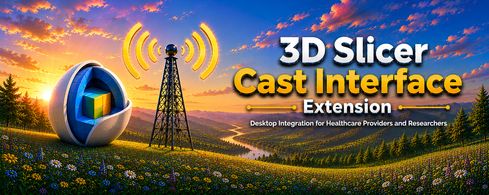

# 3D Slicer Cast Interface Extension

  

Cast Interface is a 3D Slicer extension for desktop integration workflows — Cast hub, resource servers (e.g. Total Segmentator), and an Image Display client for FHIRcast-style events over WebSockets.

**[Full documentation →](https://mbellehumeur.github.io/SlicerCastInterface/)**

## Install

1. Open **3D Slicer** → **Extension Manager**
2. Search for **Cast Interface** → **Install**
3. Restart 3D Slicer

## License

[MIT License](LICENSE)
